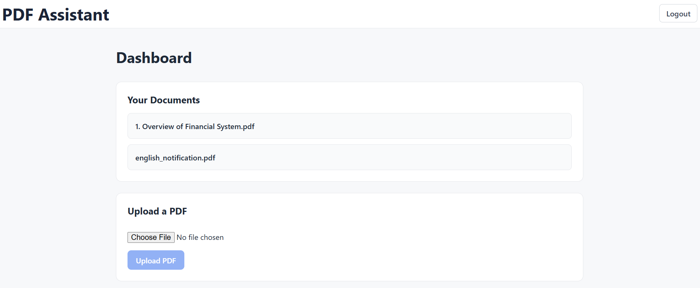
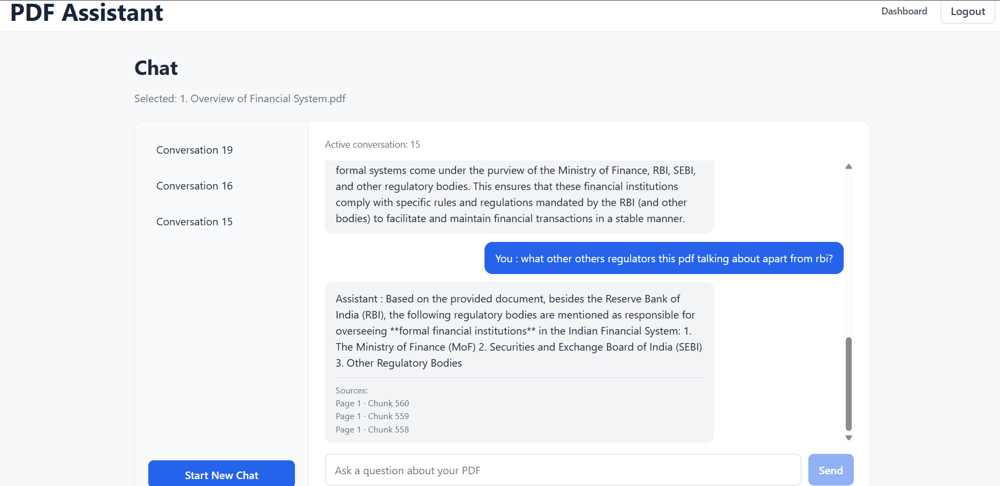
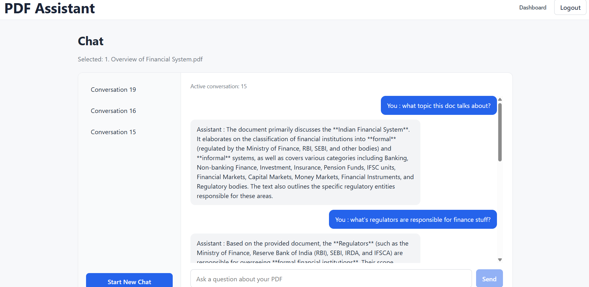

# Enterprise AI PDF Assistant

Upload PDFs and ask questions about them in natural language. Answers are generated by a locally hosted LLM using only retrieved passages from your document, with page-level source references.

**Stack:** React + TypeScript · FastAPI · PostgreSQL + pgvector · Ollama · Docker

## How It Works

On upload, the PDF text is extracted, split into overlapping chunks, and converted into embeddings using a locally hosted Ollama embedding model. When a user asks a question, pgvector retrieves the most semantically relevant chunks, which are passed along with conversation context to the local LLM to generate a grounded answer with document page references.

## Screenshots

### Dashboard

Upload and manage documents from the authenticated dashboard.



### RAG Response

Ask questions and view grounded answers with document page references.



### Conversation History

Continue previous conversations and review earlier questions and answers.



## Features

### Auth & Security
* User signup and login with JWT authentication
* Protected user-specific documents and conversations
* User ownership and access isolation for documents and conversations
* Protection against treating untrusted document content as system instructions
* Frontend validation, error and empty states

### Document Processing
* PDF upload with file validation and size limits
* PDF text extraction using PyMuPDF
* Recursive text chunking with overlap
* 768-dimensional document embeddings using `embeddinggemma`

### RAG & Chat
* Vector similarity search using PostgreSQL + pgvector, retrieving the top 5 relevant document chunks
* RAG-based question answering using `qwen3.5:0.8b`
* Responses grounded in retrieved document content
* Conversational context using up to 10 previous messages
* Source references with document chunk and page information
* Follow-up questions within conversations
* Multiple conversations per document
* Conversation creation, switching, and persistent message history

### Infrastructure
- Dockerized frontend, backend and PostgreSQL services
- Local LLM and embedding inference through Ollama

## Architecture

```text
                         Browser
                            │
                            ▼
                  React + TypeScript
                     (Nginx :5173)
                            │
                            │ HTTP
                            ▼
                    FastAPI Backend
                       (:8000)
                     /          \
                    /            \
                   ▼              ▼
        PostgreSQL + pgvector    Ollama
               (:5432)        (host machine)
                   │            │
                   │            ├── embeddinggemma
                   │            └── qwen3.5:0.8b
                   ▼
              Document Data
              + Embeddings
              + Conversations
              + Messages
```

When running with Docker Compose, the frontend, backend and PostgreSQL services communicate through the automatically created Compose network. Ollama runs locally on the host machine and is accessed by the backend through `host.docker.internal`.

## RAG Pipeline

```text
PDF Upload
    │
    ▼
Text Extraction
    │
    ▼
Text Chunking
    │
    ▼
Embedding Generation
    │
    ▼
PostgreSQL + pgvector
    │
    │
User Question
    │
    ▼
Question Embedding
    │
    ▼
Vector Similarity Search
    │
    ▼
Top Relevant Chunks
    │
    + Previous Conversation Context
    │
    ▼
LLM Prompt
    │
    ▼
Ollama LLM
    │
    ▼
Grounded Answer + Sources
```

## Design Decisions

**pgvector inside PostgreSQL**
PostgreSQL already stores the application's relational data, so keeping embeddings in the same database avoids running and syncing a separate vector database. This keeps deployment simple and lets document, chunk and embedding data live under one schema and one set of migrations.

**Chunking: 600 characters, 100 overlap**
Chunks are small enough to keep retrieved context focused, and the overlap reduces the chance of losing information at chunk boundaries. These values are starting defaults and have not yet been tuned against an evaluation set.

**Retrieving the top 5 chunks**
Five chunks provide multiple potentially relevant passages while limiting the amount of retrieved context passed to the lightweight local LLM. This is a starting default to be tuned through evaluation.

**One conversation per document**
Each conversation is tied to a single document (a document can have many conversations). This keeps retrieval scoped to one source, makes answers and page references easy to trace, and avoids cross-document confusion.

**Local inference with Ollama**
Embeddings and answer generation run locally, so document content is not sent to a third-party inference API. The application currently uses `embeddinggemma` for embeddings and `qwen3.5:0.8b` for answer generation.

**Documents are untrusted input**
Retrieved PDF text is treated as data, not instructions. The prompt separates it from the assistant's own instructions to reduce the risk of prompt injection through uploaded documents.

## Tech Stack

### Frontend

* React 19
* TypeScript
* React Router
* Vite
* Nginx for production serving

### Backend

* Python
* FastAPI
* SQLAlchemy
* Pydantic
* JWT authentication
* Argon2 password hashing
* PyMuPDF
* LangChain text splitters

### Database

* PostgreSQL 17
* pgvector
* Alembic migrations

### AI / RAG

* Ollama
* `embeddinggemma` for embeddings
* `qwen3.5:0.8b` for local generation
* Cosine similarity retrieval

### Infrastructure

* Docker
* Docker Compose

## Running the Application

### Prerequisites

Install the following:

* Docker Desktop
* Ollama
* Git

Pull the required Ollama models:
```bash
ollama pull embeddinggemma
ollama pull qwen3.5:0.8b
```

### Environment Configuration

Create a root `.env` file:
```text
SECRET_KEY=your_secure_secret_key
```

Do not commit the `.env` file.

The repository includes `.env.example` as a template.

### Start with Docker Compose

From the project root:

```bash
docker compose up --build
```

The application will start:

* Frontend: `http://localhost:5173`
* Backend API: `http://localhost:8000`
* Swagger documentation: `http://localhost:8000/docs`
* PostgreSQL: `localhost:5432`

Ollama remains running on the host machine and is accessed by the backend container through:

```text
http://host.docker.internal:11434
```

To stop the application:

```bash
docker compose down
```

The PostgreSQL volume is retained unless it is explicitly removed.

## API Overview

The FastAPI backend exposes REST endpoints for authentication, documents, conversations, and messages.

| Area                           | Purpose                                             |
| ------------------------------ | --------------------------------------------------- |
| `/auth`                        | User signup and login                               |
| `/documents`                   | PDF upload and document management                  |
| `/conversations`               | Create and manage document conversations            |
| `/conversations/{id}/messages` | Submit questions and retrieve conversation messages |

Interactive API documentation is available through FastAPI Swagger UI at:
```text
http://localhost:8000/docs
```

## Security

* JWT-based authentication protects application routes.
* Passwords are hashed using Argon2.
* Users can access only their own documents and conversations.
* Uploaded files are validated by type and size.
* Uploaded filenames are sanitized before storage.
* Document content is treated as untrusted input when constructing LLM prompts.
* Environment variables are used for secrets and environment-specific configuration.
* Secrets and local environment files are excluded from version control.

## Testing

The following scenarios were manually validated during development:
* User signup and login
* PDF upload and document processing
* RAG-based question answering with source references
* Follow-up questions using conversation context
* Multiple conversations and conversation switching
* Message persistence after page refresh
* User-specific document and conversation access
* Error and empty states
* Dockerized end-to-end application flow

The `tests/` directory contains manual verification scripts for core services, including:

* Embedding generation and vector dimensions
* LLM response generation
* RAG pipeline behavior
* Semantic retrieval behavior

These scripts invoke application services directly and print results for manual verification; they are not automated pytest tests.

Frontend linting was performed using ESLint and completed without errors.

## Project Structure

```text
PDF Assistant/
│
├── Backend/
│   ├── app/
│   │   ├── routes/
│   │   │   ├── auth.py
│   │   │   ├── conversations.py
│   │   │   ├── documents.py
│   │   │   └── messages.py
│   │   │
│   │   ├── services/
│   │   │   ├── chunking_service.py
│   │   │   ├── document_service.py
│   │   │   ├── embedding_service.py
│   │   │   ├── llm_service.py
│   │   │   ├── pdf_service.py
│   │   │   ├── prompt_service.py
│   │   │   └── retrieval_service.py
│   │   │
│   │   ├── auth.py
│   │   ├── database.py
│   │   ├── main.py
│   │   ├── models.py
│   │   └── schemas.py
│   │
│   ├── alembic/
│   ├── tests/
│   ├── Dockerfile
│   ├── .dockerignore
│   ├── requirements.txt
│   └── alembic.ini
│
├── frontend/
│   ├── src/
│   ├── Dockerfile
│   ├── .dockerignore
│   ├── .gitignore
│   ├── eslint.config.js
│   ├── index.html
│   ├── package.json
│   ├── package-lock.json
│   ├── tsconfig.app.json
│   ├── tsconfig.json
│   ├── tsconfig.node.json
│   └── vite.config.ts
│
├── docker-compose.yml
├── .env.example
├── .gitignore
└── README.md
```

## Known Limitations

* `qwen3.5:0.8b` is a lightweight model and may struggle with complex reasoning or multi-step questions.
* Scanned or image-only PDFs are not supported (no OCR).
* There is no formal RAG evaluation or benchmark yet; it is a planned improvement.
* Ollama must be running on the host machine and is accessed from the backend container.
* Local inference speed depends heavily on the available hardware.

## Current Scope and Future Improvements

The project focuses on demonstrating an end-to-end enterprise-style RAG application rather than production-scale infrastructure.

Possible future extensions include:
* RAG evaluation and automated quality testing
* Response streaming
* Caching for frequently repeated queries
* Rate limiting
* Background document processing
* Observability and centralized logging
* Additional document formats
